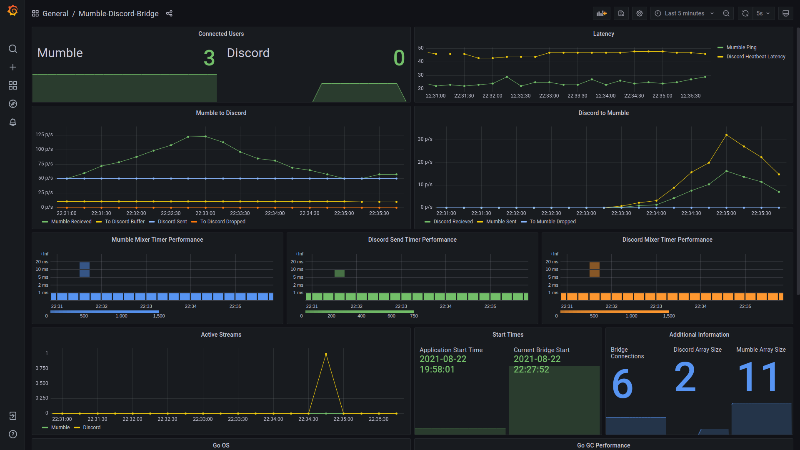

# Mumble Discord Bridge

Mumble Discord Bridge is an open source Go application to bridge the audio and chat between Mumble and Discord.

It was built with the idea that people can continue to use the voice application of their choice.

## New BridgeLib Architecture

The project now includes a modular library (`pkg/bridgelib`) that enables multiple bridge instances to share a single Discord client.

Key features of the new architecture:

- Shared Discord client (bot) for multiple bridge instances
- Proper message routing between Discord and bridge instances
- Consistent behavior between single and multi-bridge deployments
- Used by the patchcord.io multi-bridge service 😄

## PatchCord.io

Mumble Discord Bridge can be hosted on any server or computer and ships in a Docker container for convenience.

For those looking for SaaS solution take a look at [patchcord.io](https://patchcord.io).
patchcord.io offers a free tier for those who want to try out Mumble Discord Bridge, and paid tiers for those who want to handle larger communities.

## Usage

Several configuration variables are required to run the bridge.
All variables can be set using command line flags or in the environment.
The variable can also be specified in an .env file located in the working directory.
See the help documentation for all the options

```bash
./mumble-discord-bridge --help
```

The bridge can be run with the follow modes:

```text
   auto
       The bot starts up but does not connect audio channels immediately. It can be either manually linked (see below) or will join the voice channels when there's at least one person on each side.
       The audio bridge will leave both voice channels once there is no one on either end
   manual
       The bot starts up but does not connect immediately. It will join the voice channels when issued the link command via chat and will leave with the unlink command
   constant (default)
       The bridge starts up and immediately connects to both Discord and Mumble voice channels. It can not be controlled in this mode and quits when the program is stopped
```

In "auto" or "manual" modes, the bridge can be controlled in Discord with the following commands.

**Important:** Discord commands only work when sent from the configured channel (DISCORD_CID). Commands from other channels are ignored. This ensures proper isolation in multi-bridge deployments.

```text
!COMMAND link
 (Discord Only) Commands the bridge to join Discord voice and Mumble.
 The user must be in the configured voice channel (DISCORD_CID) for this to work.

!COMMAND unlink
 (Discord Only) Commands the bridge to leave Discord voice and Mumble.

!COMMAND refresh
 (Discord Only) Commands the bridge to unlink, then link again.
```

There are additional commands that can be called from either Mumble or Discord.

```text
!COMMAND help
 Print help text

!COMMAND version
 Print the version

!COMMAND restart
 Restart the bridge

!COMMAND status
 Show bridge status, uptime, and mode

!COMMAND list
 List all connected users in both Mumble and Discord.
```

## Setup

### Creating a Discord Bot

A Discord Bot is required to authenticate this application with Discord.
The guide below provides information on how to create a Discord bot.

[Create a Discord Bot](https://discordpy.readthedocs.io/en/latest/discord.html)

Individual Discord servers need to invite the bot before it can connect.  
The bot requires the following permissions:

#### General Permissions
- View Channels
#### Text Permissions
- Send Messages
- Read Message History
#### Voice Permissions
- Connect
- Speak
- Use Voice Activity

Permission integer 36768768.

### Finding Discord CID and GID

Discord GID is a unique ID linked to one Discord Server, also called Guild. CID is similarly a unique ID for a Discord Channel. To find these you need to set Discord into developer Mode.

[Instructions to enable Discord Developer Mode](https://discordia.me/en/developer-mode)

Then you can get the GID by right-clicking your server and selecting Copy-ID. Similarly the CID can be found right clicking the voice channel and selecting Copy ID.

### Generating Mumble Client (Optional)

Optionally you can specify a client certificate for mumble [Mumble Certificates](https://wiki.mumble.info/wiki/Mumble_Certificates)
If you don't have a client certificate, you can generate one with this command:

```bash
openssl req -x509 -nodes -days 3650 -newkey rsa:2048 -keyout cert.pem -out cert.pem -subj "/CN=mumble-discord-bridge"
```

### Binary

Prebuilt binaries are available.
The binaries require the opus code runtime library to be installed.

```bash
# Ubuntu
sudo apt install libopus0
```

```bash
curl -s https://api.github.com/repos/stieneee/mumble-discord-bridge/releases/latest | grep "mumble-discord-bridge" | grep "browser_download_url" | cut -d '"' -f 4 | wget -qi -
```

### Docker

This project is built and distributed in a docker container.
A sample docker command can be copied from below.
This service command will always attempt to restart the service due to the `--restart=always` flag even when the server is restarted.
For testing purposes it may be best to remove the restart flag.

Replace the environment variables with variable for the desired mumble server, discord bot and discord server/channel.

```bash
# Sample for testing
docker docker run -e MUMBLE_ADDRESS=example.com -e MUMBLE_PASSWORD=optional -e DISCORD_TOKEN=TOKEN -e DISCORD_GID=GID -e DISCORD_CID=CID stieneee/mumble-discord-bridge

# Run as a service
docker docker run -e MUMBLE_ADDRESS=example.com -e MUMBLE_PASSWORD=optional -e DISCORD_TOKEN=TOKEN -e DISCORD_GID=GID -e DISCORD_CID=CID --restart=always --name=mumble-discord-bridge -d stieneee/mumble-discord-bridge

# Stop the service
docker stop mumble-discord-bridge && docker rm mumble-discord-bridge
```

### MDB Bridge Options

The following options can be set using environment variables or with command line options.

Note boolean vales are flags when set via command line. example `-mumble-insecure -mumble-disable-text` not `-mumble-insecure true -mumble-disable-text true`.

| Environment Variable       | CLI                         | Type   | Default          | Description                                                                                                                    |
| -------------------------- | --------------------------- | ------ | ---------------- | ------------------------------------------------------------------------------------------------------------------------------ |
| CHAT_BRIDGE                | -chat-bridge                | flag   | false            | enable text chat bridge                                                                                                        |
| COMMAND                    | -command                    | string | "mumble-discord" | command phrase '!mumble-discord help' to control the bridge via text channels                                                  |
| COMMAND_MODE               | -command-mode               | string | "both"           | [both, mumble, discord, none] determine which side of the bridge will respond to commands                                      |
| DEBUG_LEVEL                | -debug-level                | int    | 1                | discord debug level                                                                                                            |
| DISCORD_CID                | -discord-cid                | string | ""               | discord cid, required                                                                                                          |
| DISCORD_TEXT_MODE          | -discord-text-mode          | string | "channel"        | disable sending direct messages to discord                                                                                     |
| DISCORD_GID                | -discord-gid                | string | ""               | discord gid, required                                                                                                          |
| DISCORD_TOKEN              | -discord-token              | string | ""               | discord bot token, required                                                                                                    |
| MODE                       | -mode                       | string | "constant"       | [constant, manual, auto] determine which mode the bridge starts in                                                             |
| MUMBLE_ADDRESS             | -mumble-address             | string | ""               | mumble server address, example example.com, required                                                                           |
| MUMBLE_CERTIFICATE         | -mumble-certificate         | string | ""               | client certificate to use when connecting to the Mumble server                                                                 |
| MUMBLE_CHANNEL             | -mumble-channel             | string | ""               | mumble channel to start in, using '/' to separate nested channels, optional                                                    |
| MUMBLE_DISABLE_TEXT        | -mumble-disable-text        | flag   | false            | disable sending text to mumble                                                                                                 |
| MUMBLE_INSECURE            | -mumble-insecure            | flag   | false            | mumble insecure, ignore ssl certificates issues                                                                                |
| MUMBLE_PASSWORD            | -mumble-password            | string | ""               | mumble password                                                                                                                |
| MUMBLE_PORT                | -mumble-port                | int    | 64738            | mumble port                                                                                                                    |
| MUMBLE_USERNAME            | -mumble-username            | string | "Discord"        | mumble username                                                                                                                |
| MUMBLE_BOT                 | -mumble-bot                 | flag   | false            | exclude bot from mumble user count, optional, requires mumble v1.5 or later                                                    |
| PROMETHEUS_ENABLE          | -prometheus-enable          | flag   | false            | enable prometheus metrics                                                                                                      |
| PROMETHEUS_PORT            | -prometheus-port            | int    | 9559             | prometheus metrics port                                                                                                        |
| TO_DISCORD_BUFFER          | -to-discord-buffer          | int    | 50               | jitter buffer from Mumble to Discord to absorb timing issues related to network, OS and hardware quality. (Increments of 10ms) |
| TO_MUMBLE_BUFFER           | -to-mumble-buffer           | int    | 50               | jitter buffer from Discord to Mumble to absorb timing issues related to network, OS and hardware quality. (Increments of 10ms) |

### Mumbler Server Setting

To ensure compatibility please edit your murmur configuration and add the following

```bash
opusthreshold=0
```

This ensures all packets are opus encoded and should not cause any compatibility issues if your users are using up to date clients.

### Chat Bridge

The chat bridge feature will relay chat messages between mumble and discord channels.
To enable the feature the MUMBLE_DISABLE_TEXT must be false and DISCORD_TEXT_MODE must be set to "channel" (the default state).
Finally the CHAT_BRIDGE variable must be set to true.

## Building From Source

This project requires Golang to build from source.
A simple go build command is all that is needed.
Ensure the opus library is installed.

```bash
go install github.com/goreleaser/goreleaser@latest
goreleaser build --skip=validate --rm-dist --single-target
```

### OpenBSD Users

OpenBSD users should consider compiling a custom kernel to use 1000 ticks for the best possible performance.
See [issue 20](https://github.com/Stieneee/mumble-discord-bridge/issues/20) for the latest discussion about this topic.

## Jitter Buffer

The bridge implements simple jitter buffers that attempt to compensate for network, OS and hardware related jitter.
These jitter buffers are configurable in both directions.
A jitter buffer will slightly the delay the transmission of audio in order to have audio packets buffered for the next time step.
The Mumble client itself includes a jitter buffer for similar reasons.
A default jitter of 50ms should be adequate for most scenarios.
A warning will be logged if short burst or audio are seen.
A single warning can be ignored multiple warnings in short time spans would suggest the need for a larger jitter buffer.

## Monitoring the Bridge (Optional)

The bridge can be started with a Prometheus metrics endpoint enabled.
The example folder contains the a docker-compose file that will spawn the bridge, Prometheus and Grafana configured to serve a single a pre-configured dashboard.

The endpoint exposes /live and /ready for use with Kubernetes.



## Known Issues

Currently there is an issue opening the discord voice channel.
It is a known issue with a dependency of this project.

Audio leveling from Discord needs to be improved.

Delays in connecting to Mumble (such as from external authentication plugins) may result in extra error messages on initial connection.

There is an issue seen with Mumble-Server (murmur) 1.3.0 in which the bridge will loose the ability to send messages client after prolonged periods of connectivity.
This issue has been appears to be resolved by murmur 1.3.4.

## Breaking Config Changes

### Version 0.7

**Command Behavior Changes:**

- Discord commands (link, unlink, refresh) now only work when sent from the configured channel (DISCORD_CID). Commands from other text channels are ignored.
- The `link` command now requires the user to be in the configured voice channel (DISCORD_CID). Previously, the bridge would join whichever voice channel the user was in. This change ensures proper isolation in multi-bridge deployments where multiple bridges may exist in the same guild.

**Removed Features:**

- Bot status updates removed. The bridge no longer updates Discord's "Listening to..." status with Mumble user counts. The `DISCORD_DISABLE_BOT_STATUS` / `-discord-disable-bot-status` config option has been removed along with this functionality.

**BridgeLib API Changes (for library users):**

- `DiscordDisableBotStatus` removed from `BridgeConfig` (feature removed)
- `Logger` interface moved to `pkg/logger` package - use `logger.Logger` instead of `bridgelib.Logger`
- `JoinVoiceChannel` removed from `DiscordProvider` interface - voice connections are now managed internally by connection managers
- New `EventDispatcher` system for subscribing to bridge events (connection status, user join/leave, etc.)

### Version 0.6

DISCORD_DISABLE_TEXT has been replaced with DISCORD_TEXT_MODE. As a result the default behavior has been change from direct messages to users "user" to "channel".

DISCORD_COMMAND has been replace with COMMAND and COMMAND_MODE. The feature now supports both mumble and discord. The default command phrase remains "!mumble-discord".

## License

Distributed under the MIT License. See LICENSE for more information.

## Contributing

Issues and PRs are welcome and encouraged.
Please consider opening an issue to discuss features and ideas.

## Acknowledgement

The project would not have been possible without:

- [gumble](https://github.com/layeh/gumble)
- [discordgo](https://github.com/bwmarrin/discordgo)
