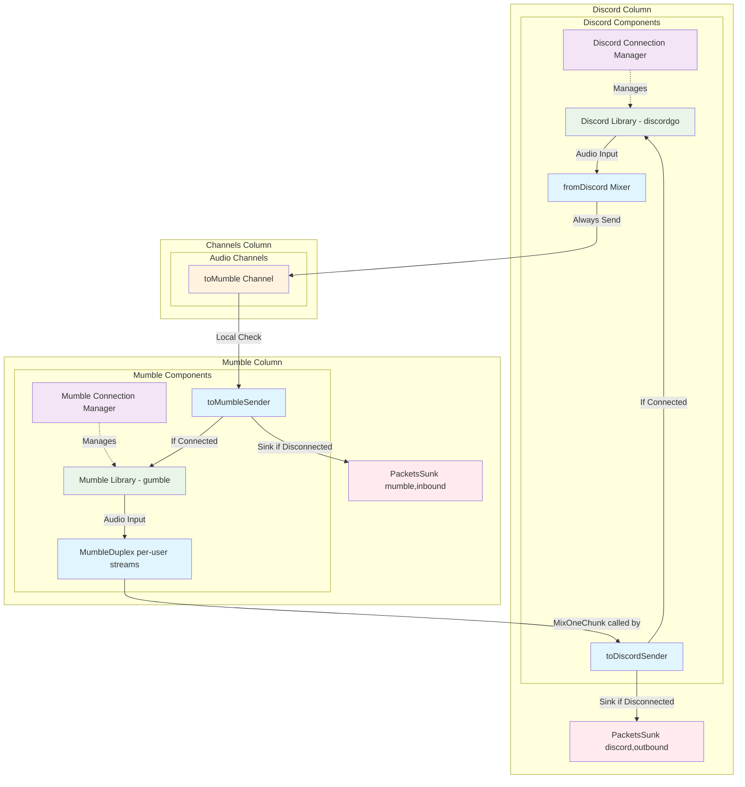

# Audio Packet Flow and Connection Management

This document describes the audio packet flow architecture and connection management system used in the mumble-discord-bridge.

## Overview

The bridge uses a **decoupled packet sinking architecture** where each component is responsible for managing its own connection state and packet sinking. This eliminates cross-dependencies and reduces complexity.

## Core Principles

1. **Local Responsibility**: Each component only checks its own connection state
2. **No Cross-Awareness**: Mumble components don't need to know Discord state and vice versa
3. **Independent Sinking**: Each side sinks packets when its own connection is down
4. **Channel-Based Communication**: Components communicate through Go channels without direct coupling

## Architecture Diagrams

### Overall Audio Flow

```
┌─────────────┐    Audio     ┌──────────────────┐    Audio     ┌─────────────┐
│   Mumble    │─────────────→│   Bridge Core    │─────────────→│   Discord   │
│   Server    │              │                  │              │   Server    │
│             │←─────────────│                  │←─────────────│             │
└─────────────┘              └──────────────────┘              └─────────────┘
```

### Detailed Component Flow



## Connection Management

### Independent Connection Managers

Each connection type has its own manager that handles:
- Connection establishment
- Health monitoring (delegated to underlying libraries)
- Automatic reconnection with exponential backoff
- Connection state reporting

```
┌─────────────────────┐              ┌─────────────────────┐
│ MumbleConnection    │              │ DiscordConnection   │
│ Manager             │              │ Manager             │
│                     │              │                     │
│ ┌─────────────────┐ │              │ ┌─────────────────┐ │
│ │ Connection Loop │ │              │ │ Connection Loop │ │
│ │                 │ │              │ │                 │ │
│ │ 1. Connect      │ │              │ │ 1. Connect      │ │
│ │ 2. Monitor      │ │              │ │ 2. Monitor      │ │
│ │ 3. Reconnect    │ │              │ │ 3. Reconnect    │ │
│ └─────────────────┘ │              │ └─────────────────┘ │
│                     │              │                     │
│ ┌─────────────────┐ │              │ ┌─────────────────┐ │
│ │ State: Connected│ │              │ │ State: Connected│ │
│ │ Library: gumble │ │              │ │ Library:discordgo│ │
│ └─────────────────┘ │              │ └─────────────────┘ │
└─────────────────────┘              └─────────────────────┘
```

### Health Monitoring Strategy

We rely on the underlying libraries for connection health:
- **gumble**: Handles Mumble connection health internally
- **discordgo**: Handles Discord connection health internally

Our connection managers only monitor basic state:
- **Mumble**: `client.State() == 1 || client.State() == 2` (Connected or Synced)
- **Discord**: `connection.Ready == true`

## Packet Sinking Architecture

### Local Responsibility Model

Each component sinks packets when **its own** connection is down:

```
Mumble Audio Input (per-user streams)
       │
       ▼
┌─────────────────┐
│  toDiscordSender│ ──► Calls MixOneChunk() inline every 10ms tick
│ (discord_duplex)│     Accumulates 2 chunks, encodes 20ms Opus frame
│                 │
│                 │     ┌─────────────────────────────────┐
│                 │────►│ IF Discord NOT connected:       │
│                 │     │   - Sink packet                 │
│                 │     │   - Increment promPacketsSunk   │
│                 │     │   - Log "sinking packet"        │
│                 │     └─────────────────────────────────┘
└─────────────────┘
```

```
Discord Audio Input
       │
       ▼
┌─────────────────┐
│  fromDiscord    │ ──► Always sends to toMumble channel
│  Mixer          │     (No Mumble state checking)
└─────────────────┘
       │
       ▼
 toMumble Channel
       │
       ▼
┌─────────────────┐     ┌─────────────────────────────────┐
│  toMumbleSender │────►│ IF Mumble NOT connected:        │
│ (mumble_duplex) │     │   - Sink packet                 │
│                 │     │   - Increment promPacketsSunk   │
│                 │     │   - Log "sinking packet"        │
│                 │     └─────────────────────────────────┘
└─────────────────┘
```

### Packet Sinking Points

| Component | Sink Condition | Metric | Direction |
|-----------|----------------|--------|-----------|
| `toDiscordSender` | Discord connection down | `promPacketsSunk{discord,outbound}` | Mumble -> Discord |
| `toMumbleSender` | Mumble connection down | `promPacketsSunk{mumble,inbound}` | Discord -> Mumble |

### Benefits of Local Responsibility

1. **No Cross-Dependencies**: Components don't need to know about other systems
2. **Simpler State Management**: Each component only tracks its own state
3. **Better Reliability**: No race conditions from checking remote state
4. **Easier Testing**: Components can be tested independently
5. **Cleaner Code**: Reduced complexity in audio processing paths

## Pacing and Buffering

### Audio Packet Timing and Rate Conversion

The bridge handles rate conversion between Mumble's 10ms native frames and Discord's 20ms Opus frames:

**Mumble -> Discord (inline mixing, 2 goroutines: per-user stream + sender):**
- gumble `OnAudioStream` callback splits incoming Mumble audio into 10ms (480-sample) chunks and writes them to per-user buffered channels
- `toDiscordSender` (in `discord_duplex.go`) - Paces at **10ms intervals** using SleepCT, calls `MixOneChunk()` to read and mix one chunk from all active streams. Accumulates two 10ms chunks via `pendingChunk`, then encodes a single 20ms Opus frame (960 samples) and sends to Discord. Sends occur at consistent **20ms intervals**.

**Discord -> Mumble (3 goroutines):**
- `discordReceivePCM` (in `discord_duplex.go`) - Receives 20ms Opus frames (960 samples), decodes, chunks into **two 10ms PCM chunks** (480 samples each)
- `fromDiscordMixer` (in `discord_duplex.go`) - Paces at **10ms intervals** using SleepCT, mixes active Discord streams, sends 10ms chunks
- `toMumbleSender` (in `mumble_duplex.go`) - **Blocking read** (no pacing), receives packets already at 10ms rate

### Channel Buffers and Stream Buffers

All buffers store **10ms packets** (480 samples @ 48kHz):

| Buffer | Packet Count | Time Buffered | Direction | Purpose |
|--------|--------------|---------------|-----------|---------|
| Per-user Mumble stream | 24 packets | 240ms | Mumble -> Discord | Per-speaker buffer absorbing TCP jitter |
| `toMumbleInternal` | 50 packets | 500ms | Discord -> Mumble | Buffers 10ms packets before sending to gumble's unbuffered channel |

**Why there is no intermediate channel for Mumble -> Discord:**
- `toDiscordSender` calls `MixOneChunk()` directly on the per-user stream buffers, eliminating the old `toDiscord` channel and `fromMumbleMixer` goroutine. This reduces pipeline latency by removing one buffering stage.

### Buffer Depth Cap (Clock Drift Protection)

`MixOneChunk()` enforces a maximum per-stream buffer depth of 4 chunks (40ms). If a stream's buffer exceeds this threshold, old chunks are skipped before reading. This prevents latency from growing monotonically when the Mumble server's clock runs slightly faster than the bridge's clock. Skipped chunks are tracked by `promMumbleChunksSkipped`.

### Send Behavior

**toDiscordSender** (in `discord_duplex.go`):
- Paces at **10ms intervals** using SleepCT
- Calls `MixOneChunk()` each tick to read one 10ms chunk from all active Mumble streams
- Accumulates two chunks via `pendingChunk` before encoding a 20ms Opus frame
- Sends at consistent **20ms intervals** (every other tick) to avoid triggering Discord's adaptive jitter buffer
- When streaming stops, sends 3 silence frames at 10ms intervals, then sets Speaking to false
- Checks Discord connection via `GetOpusChannels()` on each send (non-blocking, drops if channel full)

**toMumbleSender** (in `mumble_duplex.go`):
- **Blocking read** from `toMumbleInternal` - receives 10ms packets already paced by `fromDiscordMixer`
- **Timeout send** (20ms timeout) to gumble's unbuffered channel
- Drops packets on timeout to prevent blocking (tracked by `promMumbleSendTimeouts`)
- Detects Mumble reconnections by comparing the cached audio channel pointer against `GetAudioOutgoing()` - a different pointer means the gumble client was recreated
- No pacing needed - packets arrive at correct 10ms rate

### Rate Conversion Rationale

- **Mumble**: Native 10ms frames (480 samples @ 48kHz)
- **Discord**: Native 20ms Opus frames (960 samples @ 48kHz)
- The bridge converts between these rates to match each platform's native format
- `toDiscordSender` accumulates two 10ms chunks into one 20ms Opus frame
- `toMumbleSender` passes 10ms chunks directly (gumble handles framing)

## Connection States

### Mumble States (gumble library)
```
StateDisconnected = 0  --> Consider disconnected
StateConnected = 1     --> Consider connected (syncing)
StateSynced = 2        --> Consider connected (ready)
```

### Discord States (discordgo library)
```
connection == nil      --> Consider disconnected
connection.Ready == false --> Consider disconnected
connection.Ready == true  --> Consider connected
```

## Metrics and Monitoring

### Packet Flow Metrics
- `promReceivedMumblePackets`: Audio packets received from Mumble
- `promSentMumblePackets`: Successfully sent to Mumble
- `promDiscordReceivedPackets`: Audio packets received from Discord
- `promDiscordSentPackets`: Successfully sent to Discord
- `promPacketsSunk{service,direction}`: Packets sunk due to connection issues
- `promToMumbleDropped`: Packets dropped due to send timeout to Mumble
- `promMumbleSendTimeouts`: Same events as above (clearer naming)
- `promMumbleChunksSkipped`: Stale chunks skipped due to buffer depth exceeding threshold (indicates clock drift)

### Stream and Buffer Metrics
- `promMumbleArraySize`: Number of active per-user Mumble stream channels
- `promMumbleStreaming`: Number of streams currently producing audio
- `promDiscordArraySize`: Number of active Discord receiver entries
- `promDiscordStreaming`: Number of Discord streams currently producing audio
- `promDiscordPLCPackets`: PLC frames generated for lost Discord packets

### Timer Performance Metrics
- `promTimerDiscordSend`: SleepCT drift for Mumble->Discord sender (10ms target)
- `promTimerDiscordMixer`: SleepCT drift for Discord->Mumble mixer (10ms target)

### Connection Metrics
- `promDiscordConnectionStatus`: Discord connection state
- `promMumbleConnectionStatus`: Mumble connection state
- `promDiscordConnectionUptime`: Discord connection uptime
- `promMumbleConnectionUptime`: Mumble connection uptime

## Error Handling

### Connection Failures
- **Automatic Reconnection**: Both managers retry indefinitely with 2-second delays
- **Graceful Degradation**: Packets are sunk when connections are down
- **No Bridge Restart**: Individual connection failures don't crash the bridge

### Audio Quality
- **Clock Drift Protection**: Buffer depth cap skips stale audio to prevent growing delay
- **Consistent Send Timing**: 20ms Opus frame intervals prevent Discord jitter buffer growth
- **Immediate Response**: Components respond instantly when connections restore
- **Buffer Management**: Proper channel buffering prevents audio dropouts

## Code Locations

### Key Files
- `internal/bridge/connection_manager.go`: Base connection management
- `internal/bridge/discord_connection_manager.go`: Discord-specific connection handling
- `internal/bridge/mumble_connection_manager.go`: Mumble-specific connection handling
- `internal/bridge/discord_duplex.go`: Discord audio processing (receive, mix, send)
- `internal/bridge/mumble_duplex.go`: Mumble audio processing (stream management, mixing, send)
- `internal/bridge/bridge.go`: Audio channel management and bridge orchestration

### Audio Flow Functions
- `MixOneChunk()`: Reads one 10ms chunk from all active Mumble streams and mixes them (in `mumble_duplex.go`)
- `OnAudioStream()`: Handles incoming Mumble audio streams, splits into 10ms chunks (in `mumble_duplex.go`)
- `toDiscordSender()`: Mixes Mumble audio inline, encodes Opus, sends to Discord (in `discord_duplex.go`)
- `fromDiscordMixer()`: Processes Discord audio -> Mumble (in `discord_duplex.go`)
- `toMumbleSender()`: Sends audio to Mumble with local sinking (in `mumble_duplex.go`)

### Goroutine Summary (per bridge instance)

| Goroutine | File | Pacing | Purpose |
|-----------|------|--------|---------|
| `OnAudioStream` (N per speaker) | `mumble_duplex.go` | Event-driven | Splits gumble audio into 10ms chunks |
| `toDiscordSender` | `discord_duplex.go` | 10ms SleepCT | Mixes Mumble streams, encodes Opus, sends to Discord |
| `discordReceivePCM` | `discord_duplex.go` | Event-driven | Decodes Discord Opus into PCM chunks |
| `fromDiscordMixer` | `discord_duplex.go` | 10ms SleepCT | Mixes Discord streams, sends to toMumble channel |
| `toMumbleSender` | `mumble_duplex.go` | Blocking read | Forwards packets from toMumble channel to gumble |
