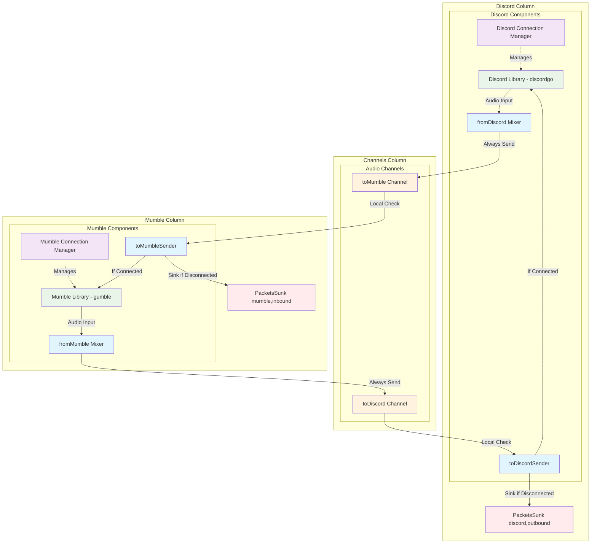

# Audio Packet Flow and Connection Management

This document describes the audio packet flow architecture and connection management system used in the mumble-discord-bridge.

## Overview

The bridge uses a **decoupled packet sinking architecture** where each component is responsible for managing its own connection state and packet sinking. This eliminates cross-dependencies and reduces complexity.

## Core Principles

1. **Local Responsibility**: Each component only checks its own connection state
2. **No Cross-Awareness**: Mumble components don't need to know Discord state and vice versa
3. **Independent Sinking**: Each side sinks packets when its own connection is down
4. **Channel-Based Communication**: Components communicate through Go channels without direct coupling

## Architecture Diagrams

### Overall Audio Flow

```
┌─────────────┐    Audio     ┌──────────────────┐    Audio     ┌─────────────┐
│   Mumble    │─────────────→│   Bridge Core    │─────────────→│   Discord   │
│   Server    │              │                  │              │   Server    │
│             │←─────────────│                  │←─────────────│             │
└─────────────┘              └──────────────────┘              └─────────────┘
```

### Detailed Component Flow



## Connection Management

### Independent Connection Managers

Each connection type has its own manager that handles:
- Connection establishment
- Health monitoring (delegated to underlying libraries)
- Automatic reconnection with exponential backoff
- Connection state reporting

```
┌─────────────────────┐              ┌─────────────────────┐
│ MumbleConnection    │              │ DiscordConnection   │
│ Manager             │              │ Manager             │
│                     │              │                     │
│ ┌─────────────────┐ │              │ ┌─────────────────┐ │
│ │ Connection Loop │ │              │ │ Connection Loop │ │
│ │                 │ │              │ │                 │ │
│ │ 1. Connect      │ │              │ │ 1. Connect      │ │
│ │ 2. Monitor      │ │              │ │ 2. Monitor      │ │
│ │ 3. Reconnect    │ │              │ │ 3. Reconnect    │ │
│ └─────────────────┘ │              │ └─────────────────┘ │
│                     │              │                     │
│ ┌─────────────────┐ │              │ ┌─────────────────┐ │
│ │ State: Connected│ │              │ │ State: Connected│ │
│ │ Library: gumble │ │              │ │ Library:discordgo│ │
│ └─────────────────┘ │              │ └─────────────────┘ │
└─────────────────────┘              └─────────────────────┘
```

### Health Monitoring Strategy

We rely on the underlying libraries for connection health:
- **gumble**: Handles Mumble connection health internally
- **discordgo**: Handles Discord connection health internally

Our connection managers only monitor basic state:
- **Mumble**: `client.State() == 1 || client.State() == 2` (Connected or Synced)
- **Discord**: `connection.Ready == true`

## Packet Sinking Architecture

### Local Responsibility Model

Each component sinks packets when **its own** connection is down:

```
Mumble Audio Input
       │
       ▼
┌─────────────────┐
│  fromMumble     │ ──► Always sends to toDiscord channel
│  Mixer          │     (No Discord state checking)
└─────────────────┘
       │
       ▼
 toDiscord Channel
       │
       ▼
┌─────────────────┐     ┌─────────────────────────────────┐
│  toDiscordSender│────►│ IF Discord NOT connected:       │
│ (discord_duplex)│     │   - Sink packet                 │
│                 │     │   - Increment promPacketsSunk   │
│                 │     │   - Log "sinking packet"        │
│                 │     └─────────────────────────────────┘
└─────────────────┘
```

```
Discord Audio Input
       │
       ▼
┌─────────────────┐
│  fromDiscord    │ ──► Always sends to toMumble channel
│  Mixer          │     (No Mumble state checking)
└─────────────────┘
       │
       ▼
 toMumble Channel
       │
       ▼
┌─────────────────┐     ┌─────────────────────────────────┐
│  toMumbleSender │────►│ IF Mumble NOT connected:        │
│ (mumble_duplex) │     │   - Sink packet                 │
│                 │     │   - Increment promPacketsSunk   │
│                 │     │   - Log "sinking packet"        │
│                 │     └─────────────────────────────────┘
└─────────────────┘
```

### Packet Sinking Points

| Component | Sink Condition | Metric | Direction |
|-----------|----------------|--------|-----------|
| `toDiscordSender` | Discord connection down | `promPacketsSunk{discord,outbound}` | Mumble → Discord |
| `toMumbleSender` | Mumble connection down | `promPacketsSunk{mumble,inbound}` | Discord → Mumble |

### Benefits of Local Responsibility

1. **No Cross-Dependencies**: Components don't need to know about other systems
2. **Simpler State Management**: Each component only tracks its own state
3. **Better Reliability**: No race conditions from checking remote state
4. **Easier Testing**: Components can be tested independently
5. **Cleaner Code**: Reduced complexity in audio processing paths

## Pacing and Buffering

### Audio Packet Timing and Rate Conversion

The bridge handles rate conversion between Mumble's 10ms native frames and Discord's 20ms Opus frames:

**Mumble → Discord:**
- `fromMumbleMixer` (in `mumble_duplex.go`) - Paces at **10ms intervals** using SleepCT, sends 480-sample (10ms) PCM chunks
- `toDiscordSender` (in `discord_duplex.go`) - Paces at **20ms intervals** using SleepCT, combines **two 10ms chunks** into one 960-sample Opus frame

**Discord → Mumble:**
- `discordReceivePCM` (in `discord_duplex.go`) - Receives 20ms Opus frames (960 samples), chunks into **two 10ms PCM chunks** (480 samples each)
- `fromDiscordMixer` (in `discord_duplex.go`) - Paces at **10ms intervals** using SleepCT, sends 10ms chunks
- `toMumbleSender` (in `mumble_duplex.go`) - **Blocking read** (no pacing), receives packets already at 10ms rate

### Channel Buffers

All buffers store **10ms packets** (480 samples @ 48kHz), regardless of send rate:

| Buffer | Packet Count | Time Buffered | Direction | Purpose |
|--------|--------------|---------------|-----------|---------|
| `toMumbleInternal` | 50 packets | 0.5 seconds | Discord → Mumble | Buffers 10ms packets before sending to gumble's unbuffered channel |
| `toDiscord` | 50 packets | 0.5 seconds | Mumble → Discord | Buffers 10ms packets before combining and encoding to 20ms Opus frames |

**Why 10ms is the fundamental unit:**
- Both mixers (`fromDiscordMixer` and `fromMumbleMixer`) output at 10ms intervals
- Buffers store these 10ms packets, even when the sender reads at a different rate
- `toDiscordSender` reads 2 packets at a time (every 20ms), but the buffer still stores 10ms packets
- This makes buffer sizing consistent: 50 packets = 0.5 seconds, 100 packets = 1 second

### Send Behavior

**toMumbleSender** (in `mumble_duplex.go`):
- **Blocking read** from `toMumbleInternal` - receives 10ms packets already paced by `fromDiscordMixer`
- **Timeout send** (20ms timeout) to gumble's unbuffered channel
- Drops packets on timeout to prevent blocking (tracked by `promMumbleSendTimeouts`)
- No pacing needed - packets arrive at correct 10ms rate

**toDiscordSender** (in `discord_duplex.go`):
- **Blocking read** from `toDiscord` - receives 10ms PCM chunks from `fromMumbleMixer`
- **Paces at 20ms intervals** - waits for two 10ms chunks before encoding
- Combines two 10ms PCM chunks (480 samples each) into one 20ms Opus frame (960 samples)
- Sends encoded Opus to Discord

### Rate Conversion Rationale

- **Mumble**: Native 10ms frames (480 samples @ 48kHz)
- **Discord**: Native 20ms Opus frames (960 samples @ 48kHz)
- The bridge converts between these rates to match each platform's native format
- This explains why `toDiscordSender` paces at 20ms while `toMumbleSender` doesn't pace at all

## Connection States

### Mumble States (gumble library)
```
StateDisconnected = 0  ──► Consider disconnected
StateConnected = 1     ──► Consider connected (syncing)
StateSynced = 2        ──► Consider connected (ready)
```

### Discord States (discordgo library)
```
connection == nil      ──► Consider disconnected
connection.Ready == false ──► Consider disconnected  
connection.Ready == true  ──► Consider connected
```

## Metrics and Monitoring

### Packet Flow Metrics
- `promSentMumblePackets`: Successfully sent to Mumble
- `promSentDiscordPackets`: Successfully sent to Discord
- `promPacketsSunk{target,direction}`: Packets sunk due to connection issues
- `promToDiscordDropped`: Packets dropped due to buffer full
- `promToMumbleDropped`: Packets dropped due to buffer full

### Connection Metrics
- `promDiscordConnectionStatus`: Discord connection state
- `promMumbleConnectionStatus`: Mumble connection state
- `promDiscordConnectionUptime`: Discord connection uptime
- `promMumbleConnectionUptime`: Mumble connection uptime

## Error Handling

### Connection Failures
- **Automatic Reconnection**: Both managers retry indefinitely with 5-second delays
- **Graceful Degradation**: Packets are sunk when connections are down
- **No Bridge Restart**: Individual connection failures don't crash the bridge

### Audio Quality
- **No Artificial Delays**: Removed timeout delays from audio processing
- **Immediate Response**: Components respond instantly when connections restore
- **Buffer Management**: Proper channel buffering prevents audio dropouts

## Code Locations

### Key Files
- `internal/bridge/connection_manager.go`: Base connection management
- `internal/bridge/discord_connection_manager.go`: Discord-specific connection handling
- `internal/bridge/mumble_connection_manager.go`: Mumble-specific connection handling
- `internal/bridge/discord_duplex.go`: Discord audio processing (receive, mix, send)
- `internal/bridge/mumble_duplex.go`: Mumble audio processing (receive, mix, send)
- `internal/bridge/bridge.go`: Audio channel management and bridge orchestration

### Audio Flow Functions
- `fromMumbleMixer()`: Processes Mumble audio → Discord (in `mumble_duplex.go`)
- `fromDiscordMixer()`: Processes Discord audio → Mumble (in `discord_duplex.go`)
- `toDiscordSender()`: Sends audio to Discord with local sinking (in `discord_duplex.go`)
- `toMumbleSender()`: Sends audio to Mumble with local sinking (in `mumble_duplex.go`)

## Future Improvements

1. **Enhanced Metrics**: Add more detailed packet loss and latency metrics
2. **Dynamic Buffer Sizing**: Adjust channel buffer sizes based on load
3. **Connection Quality Metrics**: Expose connection quality information
4. **Graceful Shutdown**: Improve shutdown coordination between components